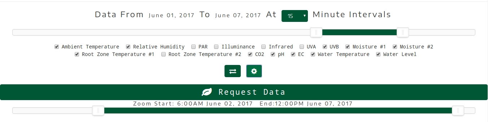
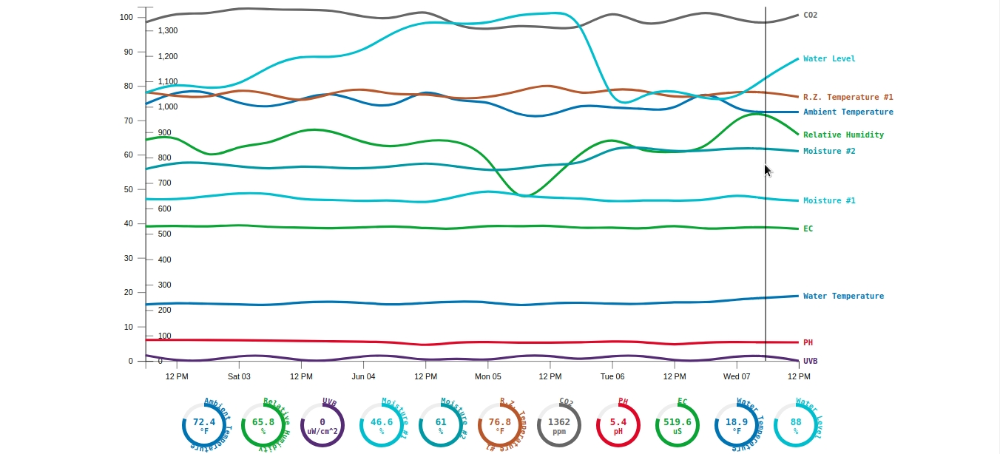

# d3-multi-line-graph
D3.js Multi-Line Graph with Dual Axes, Zoom, Value Readouts, Interactive Controls

##### Download Source Files
$ curl -LO https://github.com/alexhla/d3-multi-line-graph/archive/master.zip
##### Unzip
$ unzip master.zip
##### Navigate to Project
$ cd d3-multi-line-graph-master
##### Launch with any Web Browser
$ firefox index.html

	
	

